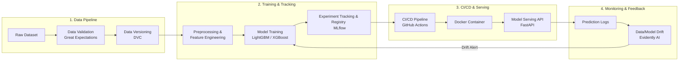

# โครงงาน MLOps: ระบบคาดการณ์ระยะเวลาส่งอาหาร (Food Delivery Time Prediction System)

---

## 1. ข้อมูลทั่วไปของโครงงาน (Project Overview)
* **ชื่อภาษาไทย**: ระบบคาดการณ์ระยะเวลาส่งอาหารอัจฉริยะสำหรับแพลตฟอร์มเดลิเวอรี
* **ชื่อภาษาอังกฤษ**: Intelligent Food Delivery Time Prediction System
* **ML Task**: Tabular Regression (เป้าหมายคือทำนายระยะเวลา `Delivery_Time_Minutes`)
* **ประเภทข้อมูล**: Tabular Data (ข้อมูลเชิงตาราง ประกอบด้วย พิกัดภูมิศาสตร์, สภาพอากาศ, ความหนาแน่นของการจราจร, ประเภทยานพาหนะ, เวลาที่สั่งซื้อ)

---

## 2. ผู้มีส่วนได้ส่วนเสียและคุณค่าที่ระบบสร้างได้ (Stakeholders & Business Value)

| ผู้มีส่วนได้ส่วนเสีย (Stakeholders) | ปัญหาที่พบ (Pain Point) | คุณค่าที่ระบบส่งมอบ (Business Value) |
|---|---|---|
| **ลูกค้า (End Customers)** | รออาหารโดยไม่ทราบเวลาแน่นอน เกิดความหงุดหงิดเมื่ออาหารส่งช้ากว่าที่คิด | ได้รับเวลาประมาณการ (ETA) ที่แม่นยำ วางแผนเวลาได้ดีขึ้น เพิ่มความพึงพอใจและลดอัตราการยกเลิกคำสั่งซื้อ |
| **ผู้ขับขี่/ไรเดอร์ (Riders)** | วางแผนรอบวิ่งงานผิดพลาด จัดการคิวงานลำดับถัดไปได้ยาก | ทราบเวลาที่ต้องใช้จริงในแต่ละเส้นทาง สามารถกระจายงานและวางแผนเส้นทางได้อย่างมีประสิทธิภาพ |
| **ร้านอาหาร (Merchants)** | กะเวลาเตรียมอาหารไม่สอดคล้องกับเวลาที่ไรเดอร์เดินทางมาถึง | จัดคิวทำอาหารได้ตรงจังหวะ อาหารไม่เย็นชืดหรือรอนานเกินไป |
| **ฝ่ายปฏิบัติการแพลตฟอร์ม (Platform Ops)** | การจับคู่ออเดอร์ (Matching & Dispatching) ไม่มีประสิทธิภาพ ต้นทุนชดเชยสูง | อัลกอริทึม Dispatch ทำงานได้แม่นยำขึ้น ลด Customer Support Ticket เรื่องอาหารล่าช้า |

---

## 3. ทำไมต้องใช้ Machine Learning แทนการเขียนกฎเกณฑ์ (ML vs. Rule-based)

### ข้อจำกัดของ Rule-based (เช่น สูตรคำนวณระยะทางหารด้วยความเร็วเฉลี่ย: `Time = Distance / Speed`):
1. **ความสัมพันธ์ไม่เป็นเชิงเส้น (Non-linear Interactions)**: ระยะทาง 3 กิโลเมตรในช่วงเวลาปกติอาจใช้เวลา 10 นาที แต่ในชั่วโมงเร่งด่วนที่ฝนตก อาจกลายเป็น 35 นาที กฎแบบ `if-else` ไม่สามารถครอบคลุมตัวแปรผสมผสานได้ครบถ้วน
2. **ตัวแปรแวดล้อมมีมิติสูง (High-dimensional Factors)**: สภาพอากาศ (ฝนตก, หมอก, พายุ), ความหนาแน่นของรถบนถนน (Low, Medium, High, Jam), เทศกาลวันหยุด, ประเภทพาหนะ (มอเตอร์ไซค์, จักรยาน, สกูตเตอร์), และพิกัดร้านอาหาร/ลูกค้า
3. **การปรับตัวช้า (Lack of Adaptability)**: หากสภาพเมืองหรือพฤติกรรมการจราจรเปลี่ยนแปลง กฎเกณฑ์ที่มนุษย์เขียนไว้จะล้าสมัยทันที ในขณะที่โมเดล ML สามารถเทรนซ้ำ (Retrain) ตามข้อมูลใหม่ได้อัตโนมัติ

---

## 4. แหล่งข้อมูลและฟีเจอร์ที่ใช้ (Dataset & Features)
* **Dataset ที่แนะนำ**: *Food Delivery Dataset* (มีอยู่แล้วบน Kaggle พร้อมใช้งาน ไม่ต้องเสียเวลาทำ Data Scraping)
* **Target Feature**: `Time_taken(min)` (ตัวเลขต่อเนื่อง)
* **Input Features**:
  * **Geospatial**: `Restaurant_latitude`, `Restaurant_longitude`, `Delivery_location_latitude`, `Delivery_location_longitude` (สามารถคำนวณเป็นระยะทาง Haversine Distance)
  * **Environmental & Traffic**: `Weatherconditions` (Sunny, Rainy, Stormy, etc.), `Road_traffic_density` (Low, Medium, High, Jam)
  * **Temporal**: `Order_Date`, `Time_Orderd`, `Time_Order_picked` (สกัดเป็น Hour of day, Day of week, Preparation time)
  * **Driver & Vehicle**: `Delivery_person_Age`, `Delivery_person_Ratings`, `Vehicle_condition`, `Type_of_vehicle`
  * **Order Specifics**: `Type_of_order`, `multiple_deliveries`, `Festival`, `City`

---

## 5. สถาปัตยกรรม MLOps แบบครบวงจร (End-to-End MLOps Architecture)

### รายละเอียดองค์ประกอบ MLOps:
1. **Data Management & Versioning**:
   * จัดการเวอร์ชันข้อมูลด้วย **DVC** เชื่อมต่อกับ Local Storage หรือ Google Drive / S3
   * ตรวจสอบ Data Quality ด้วย **Great Expectations** (เช่น พิกัดละติจูด/ลองจิจูดต้องอยู่ในช่วงที่ถูกต้อง, ค่า Delivery Time ต้องไม่ติดลบ)
2. **Model Training & Experiment Tracking**:
   * **Model**: LightGBM / XGBoost Regressor (เร็ว, น้ำหนักเบา, ประสิทธิภาพสูงมากสำหรับ Tabular Data)
   * **Evaluation Metrics**: MAE (Mean Absolute Error), RMSE (Root Mean Squared Error), $R^2$ Score
   * **Tracking**: ใช้ **MLflow** บันทึก Hyperparameters, Metrics, และ Model Artifacts
3. **Model Serving & Deployment**:
   * สร้าง REST API ด้วย **FastAPI** มี Endpoint `/predict` และ `/health`
   * ทำ **Containerization** ด้วย **Docker** ขนาดกะทัดรัด สามารถรันได้ทั้งบน Local และ Cloud VM
4. **Monitoring & Drift Detection**:
   * จำลอง Production Traffic และตรวจสอบ Data Drift / Concept Drift ด้วย **Evidently AI** (เช่น จำลองเหตุการณ์ฝนตกหนักต่อเนื่องเพื่อดูว่าโมเดลทำนายคลาดเคลื่อนหรือไม่)
   * ตั้งเกณฑ์เตือน (Drift Alert) สำหรับ Trigger ให้เกิด Automated Retraining

---

## 6. แผนการดำเนินงานสู่ Deadline (Roadmap 9 - 13 ตุลาคม)

* **วันที่ 9 - 10 ต.ค.**: ยื่น Proposal อนุมัติหัวข้อ, เตรียม Dataset, ตั้งค่า Git + DVC + โครงสร้างโปรเจกต์
* **วันที่ 11 ต.ค.**: Data Preprocessing, พัฒนา Pipeline การฝึกโมเดล และทดสอบ Experiment Tracking ด้วย MLflow
* **วันที่ 12 ต.ค.**: พัฒนา FastAPI Endpoint, ทำ Dockerfile, และตั้งค่า Evidently AI สำหรับจำลอง Data Drift
* **วันที่ 13 ต.ค.**: สรุปรายงานผล, ตรวจสอบความถูกต้อง End-to-End, และส่งงาน

